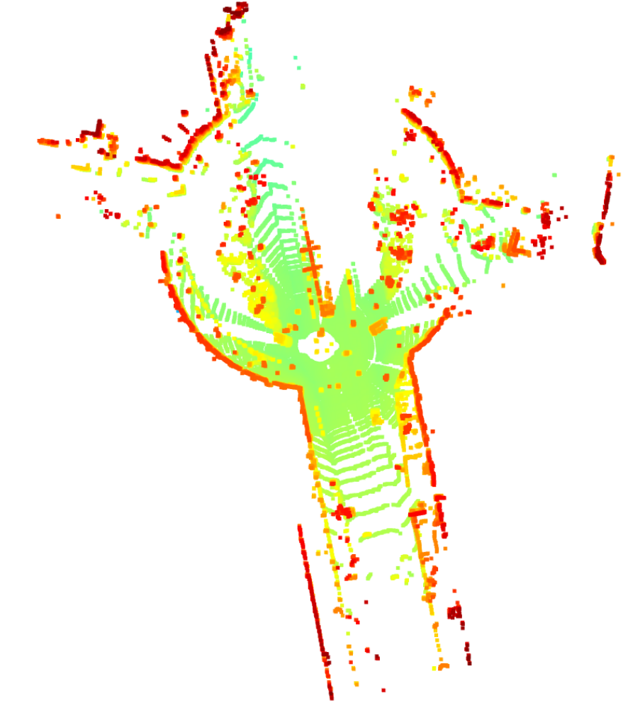

# LiDAR Point Cloud Processing

This project processes LiDAR point cloud data from the KITTI dataset using Open3D. The pipeline includes:
- Loading the raw point cloud
- Downsampling with a voxel grid
- Filtering noise using statistical outlier removal
- Segmenting ground vs. objects using RANSAC

## Screenshots
- **Raw Point Cloud**  
  
- **Downsampled Point Cloud**  
  
- **Filtered Point Cloud**  
  
- **Ground vs. Objects**  
  

## Requirements
- `Python 3.x`
- `open3d`
- `numpy`

## Setup
1. Clone this repository:

      git clone https://github.com/MazaBaap/lidar-point-cloud-processing.git cd lidar-point-cloud-processing

2. Install dependencies:

      pip install open3d numpy

3. Download the KITTI dataset and place the `.bin` files in a `kitti/` directory within the project.
4. Run the notebook:

      jupyter notebook lidar_processing.ipynb
