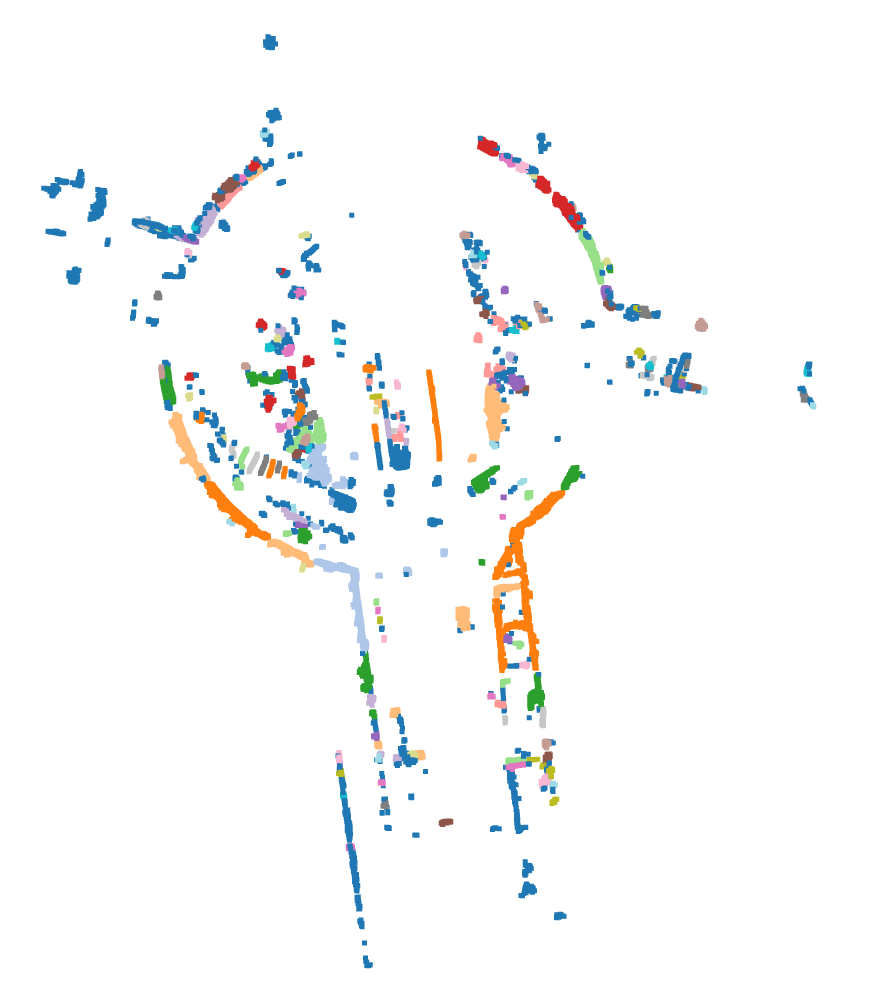

# LiDAR Processing Pipeline

This project processes LiDAR point cloud data from the KITTI dataset for object segmentation and labeling, tailored for Advanced Driver Assistance Systems (ADAS) applications.

## Overview
- **Dataset**: KITTI Raw (2011_09_26_drive_0005_sync)
- **Tools**: Open3D, Python, NumPy, Matplotlib
- **Steps**: 
  - Load the raw point cloud
  - Downsample with a voxel grid
  - Filter noise using statistical outlier removal
  - Segment ground vs. objects using RANSAC
  - Cluster obstacles using DBSCAN
  - Label clusters as "Car" or "Pedestrian" based on size
  - Process a sequence of frames
  - **Unique Feature**: 3D bounding boxes for object detection

## Screenshots
- **Raw Point Cloud**  
  
- **Downsampled Point Cloud**  
  
- **Filtered Point Cloud**  
  
- **Ground vs. Objects**  
  
- **Clustered Obstacles**  
  
- **Sequence Frame 0**  
  
- **Sequence Frame 4**  
  
- **3D Bounding Boxes**  
  

## Requirements
- `Python 3.x`
- `open3d`
- `numpy`

## Setup
1. Clone this repository:
      ```bash
      git clone https://github.com/hrithikchimbalkar/lidar-point-cloud-processing.git

      cd lidar-point-cloud-processing

2. Install dependencies:
      ```bash
      pip install -r requirements.txt

3. Download the KITTI dataset and place the `.bin` files in a `kitti/` directory within the project.
4. Run the notebook:
      ```bash
      lidar_processing.ipynb

5. (Optional) Generate .pcd files by running the sequence processing cells, which will be saved in the output/ directory.

## Experiment with Parameters
The parameter values used in this pipeline (e.g., voxel size, eps, min_points, distance thresholds) were chosen as a starting point but may not be optimal for all scenarios. We encourage you to explore and adjust these parameters in `lidar_processing.ipynb` to improve results for your specific use case. Have fun experimenting!
- **Examples to Try**:
  - Voxel size (downsampling): 0.05, 0.2
  - DBSCAN eps: 0.3, 0.7
  - DBSCAN min_points: 5, 20
  - RANSAC distance_threshold: 0.2, 0.5
